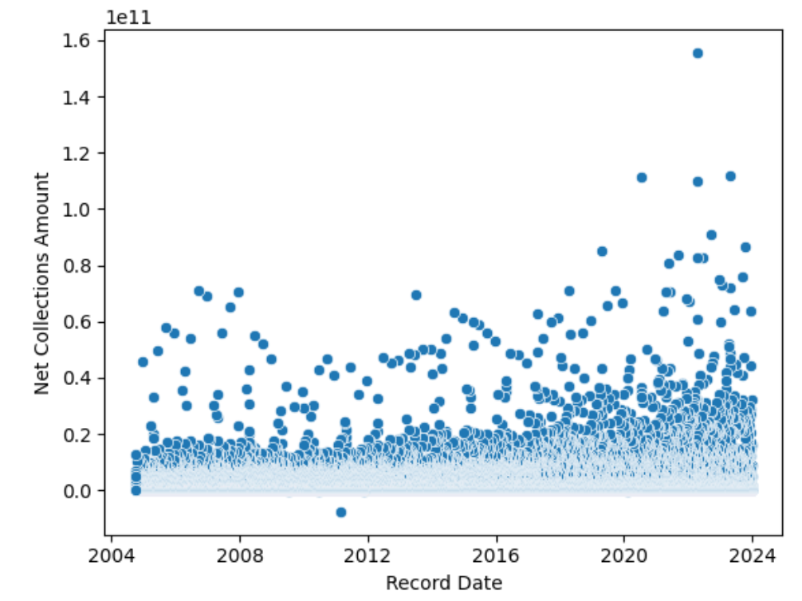

# CSE 151A Project - Group Report

**Authors**

Rehan Ali <rmali@ucsd.edu> (Github: rmali-ucsd),

Aritra Ghosh <a7ghosh@ucsd.edu>,

Scott Webster <s1webste@ucsd.edu>,

Peter Chang <p7chang@ucsd.edu>,

Yuhang Jiang <yuj052@ucsd.edu>,

Milo Nguyen <mtn022@ucsd.edu>,

Trevor Tran <trt004@ucsd.edu>,

Michael Lue <mlue@ucsd.edu>,

Jeffrey Do <jtdo@ucsd.edu>,

Joseph Kan <jokan@ucsd.edu> (Github: Person1234565)

**Date**
03-13-2024

## A. Introduction

This project aims to explore the "U.S. Government Revenue Collections" dataset from Kaggle, and use it in supervised machine learning models to predict future revenues.

The data give insights to where the federal revenues come from, and how much comes from tax contributions or national services, etc. A good prediction of future revenues compared to budget spending in a given year can help the government address the federal deficit. Not to mention, accurately forecasting revenue allows for more informed policy decisions, ultimately leading to efficient government spending and investment. These insights can help guide and enhance revenue collecting strategies, ensuring financial stability and growth.

We hypothesize that certain categories and channel types, as well as the date of collection affect the net revenue amount collected.

## B. Figures

(any suggestion for key figures?)

## C. Methods

### Exploratory data analysis (EDA)

- We explored the shape and types of the data, unique values, missing entries. etc.
- We also used heatmaps to visualize correlations between multiple variables.
- Frequency tables were used to show the distribution of categorical data points.
- Scatterplot was used to identify data points that deviate significantly from the majority.

### Data Preprocessing

- Checked for null values and dropped duplicate entries.
- Dropped columns: 'Source Line Number', 'Electronic Category Description', 'Channel Type Description', 'Tax Category Description'.
- 'Record Date' feature is discretized into an integer. For example, the oldest entry is at day 0, and the latest entry is at day 7026. This will help us model the relationship between the date of collection and the revenue (target class).
- Removed string features and kept encoded integers including the 'Fiscal Quarter Number'.
- We used a line chart to investigate Net Collection Amounts by Fiscal Year.

### Method 1: Linear Regression

- We used one-hot encoding on these categories: 'Electronic Category ID', 'Channel Type ID', 'Tax Category ID'.
- Splitted the data into training and testing sets with the ratio of 80:20.
- Plotted the prediction versus the true value on a scatterplot for each feature.
- Analyzed the Mean Squared Error (MSE), and Mean Absolute Error (MAE) on the training and testing set.

### Method 2: 3-Hidden Layer Neural Network

Processing the data:

- We used the StandardScaler from scikit-learn to normalize 'Record Date Discretized'
- These columns are also one-hot encoded: 'Calendar Year', 'Calendar Quarter Number', 'Calendar Month Number', 'Calendar Day Number', 'Fiscal Quarter Number', 'Fiscal Year'.
- We used uniform discretization on the target.
- RandomUnderSampler from scikit-learn was used to undersample since data skews too heavily towards one class.
- Splitted the data into training and testing sets with the ratio of 90:10.

Implementing our Neural Network:

- We used Dense layers and the ReLU activation function on each hidden layer
- Layer 1: 64 units
- Layer 2: 32 units
- Layer 3: 24 units
- We used SoftMax activation on the output layer and made sure that it had the same shape as our target
- Adam optimization algorithm and Categorical Cross-Entropy Loss Function were used to train our model

We would stop the training process early if the conditions were met:

```
early_stopping = tf.keras.callbacks.EarlyStopping(
  monitor='val_loss',
  min_delta=0,
  patience=2,
  verbose=0,
  mode='auto',
  baseline=None,
  restore_best_weights=False,
  start_from_epoch=0
)
```

- Lastly, we used 5-fold Cross Validation to evaluate our model:

```
converted_classifier = KerasClassifier(model=classifier, epochs=10, batch_size=100, verbose=0) # before submitting please set verbose = 0, and rerun. If not grading will be no bueno!
kfold = RepeatedKFold(n_splits = 5, n_repeats = 5)
results = cross_validate(converted_classifier, x_train_class, y_train_class, cv=kfold, n_jobs = 1)
```

### Method 3:

## D. Results

### Exploratory data analysis (EDA)

- Shape of our data: `(81248, 15)`
- There is no missing entry or null values in our dataset
- Data Types:

```
Record Date                         object
Electronic Category Description     object
Channel Type Description            object
Tax Category Description            object
Net Collections Amount             float64
Electronic Category ID               int64
Channel Type ID                      int64
Tax Category ID                      int64
Source Line Number                   int64
Fiscal Year                          int64
Fiscal Quarter Number                int64
Calendar Year                        int64
Calendar Quarter Number              int64
Calendar Month Number                int64
Calendar Day Number                  int64
dtype: object
```

- Categorical Distributions

| Channel Type Description | Count |
| ------------------------ | ----- |
| Bank                     | 12443 |
| Internet                 | 13911 |
| Mail                     | 20345 |
| Other                    | 66    |
| Over-the-Counter (OTC)   | 34483 |

| Tax Category Description | Count |
| ------------------------ | ----- |
| IRS Non-Tax              | 18545 |
| IRS Tax                  | 24843 |
| Non-Tax                  | 37860 |

- Net Collections Amount distribution among categories

| Electronic Category Description | Net Collections Amount |
| ------------------------------- | ---------------------- |
| Electronic Settlement           | 5.683999e+12           |
| Fully Electronic - All          | 6.248116e+13           |
| Fully Electronic - FS           | 6.513066e+11           |
| Non-Electronic                  | 4.469666e+12           |

| Channel Type Description | Net Collections Amount |
| ------------------------ | ---------------------- |
| Bank                     | 1.574290e+13           |
| Internet                 | 4.660688e+13           |
| Mail                     | 8.189791e+12           |
| Other                    | 2.569657e+07           |
| Over-the-Counter (OTC)   | 2.746536e+12           |
|                          |                        |

| Tax Category Description | Net Collections Amount |
| ------------------------ | ---------------------- |
| IRS Non-Tax              | 2.529981e+09           |
| IRS Tax                  | 6.110596e+13           |
| Non-Tax                  | 1.217764e+13           |

- Visualisations


Figure n. Heatmap exploring correlations between data points


Figure n. Scatterplot visualizing the distribution of Net Collections Amount from 2004 - 2024

### Data Preprocessing


Figure n. DataFrame after preprocessing


Figure n. Net Collections Amount by Electronic Category Description


Figure n. Net Collections Amount by Channel Type Description


Figure n. Net Collections Amount by Tax Category Description


Figure n. Average Net Collections Amount by Fiscal Year

### Method 1: Linear Regression

- Training MSE: 9.921680122975543e+18
- Test MSE: 8.863121770208695e+18

- Training MAE: 1363190931.6938503
- Test MAE: 1346315683.6159906

|  |  |
| ------------------------------------------------------------------------------ | ---------------------------------------------------- |
|                            |  |
|                            |  |
|                            |  |

Figure n. Scatterplots comparing True Value vs Prediction of each feature.

### Method 2: 3-Hidden Layer Neural Network

- Test accuracy 0.882727852135118
- Train accuracy 0.9061857861546092
- Detailed Reports:

| Test         | precision | recall | f1-score | support |
| ------------ | --------- | ------ | -------- | ------- |
| 0            | 0.00      | 0.00   | 0.00     | 0       |
| 1            | 0.94      | 0.96   | 0.95     | 1383    |
| 2            | 0.42      | 0.44   | 0.43     | 135     |
| 3            | 0.29      | 0.07   | 0.11     | 29      |
| 4            | 0.29      | 0.25   | 0.27     | 8       |
|              |           |        |          |         |
| micro avg    | 0.89      | 0.89   | 0.89     | 1555    |
| macro avg    | 0.39      | 0.34   | 0.35     | 1555    |
| weighted avg | 0.88      | 0.89   | 0.88     | 1555    |

| Test         | precision | recall | f1-score | support |
| ------------ | --------- | ------ | -------- | ------- |
| 0            | 0.00      | 0.00   | 0.00     | 1       |
| 1            | 0.96      | 0.97   | 0.96     | 12314   |
| 2            | 0.54      | 0.62   | 0.58     | 1223    |
| 3            | 0.55      | 0.14   | 0.22     | 303     |
| 4            | 0.40      | 0.33   | 0.36     | 125     |
|              |           |        |          |         |
| micro avg    | 0.91      | 0.91   | 0.91     | 13966   |
| macro avg    | 0.49      | 0.41   | 0.42     | 13966   |
| weighted avg | 0.91      | 0.91   | 0.91     | 13966   |


Figure n. Our training vs. validation loss curve for the classification model

- Results from 5-fold Cross Validation

```
{'fit_time': array([3.06173301, 2.28290009, 2.91096926, 2.28356886, 5.65043139,
        4.67005944, 4.95075941, 3.08874106, 2.87767005, 3.06847882,
        2.29236913, 5.89590001, 5.66160393, 2.2842021 , 3.08835483,
        3.0817461 , 5.63335752, 3.38426137, 3.0807209 , 3.07273555,
        3.08618426, 2.26404953, 3.05224347, 3.09446478, 2.40452385]),
 'score_time': array([0.17636251, 0.17707229, 0.1736536 , 0.17748141, 0.5534513 ,
        0.61605811, 0.39125013, 0.15768123, 0.17943549, 0.17558837,
        0.16396952, 0.38887691, 0.34246421, 0.17547417, 0.18276715,
        0.31620049, 0.18085265, 0.30872846, 0.18151426, 0.15895343,
        0.34406638, 0.16248918, 0.15803552, 0.252074  , 0.16214705]),
 'test_score': array([0.89798087, 0.90081474, 0.905774  , 0.9032601 , 0.90077959,
        0.9068367 , 0.90116897, 0.8983351 , 0.89581857, 0.90184266,
        0.9047113 , 0.9047113 , 0.8993978 , 0.90219702, 0.89510985,
        0.90294013, 0.90223167, 0.90081474, 0.89617293, 0.9032601 ,
        0.9004605 , 0.9025859 , 0.90329437, 0.8990078 , 0.89794472])}
```

### Method 3:

- Present the key findings of your analysis.
- Use visualizations (charts, graphs) to effectively communicate the results.
- Include tables or metrics to quantify your findings when appropriate.
- Discuss the performance of your models or the validity of your hypothesis.

## E. Discussion

### Exploratory data analysis (EDA)

The frequency tables reveal that most of the revenue comes from certain categories (IRS Tax and Non-Tax) which confirms our hypothesis that certain avenues are more profitable than others.

The heatmap in Figure n finds that the Net Collections Amount is strongly correlated to the different category IDs, which means certain transaction categories bring in more revenue than others.

The scatterplot of Net Collections Amount from 2004 - 2024 reveals that the majority of collections made were small, with a sparse number of outlying large collections. There is a noticeable trend that these outliers increase in count and magnitude each passing year.

This poses the questions: does this correspond to the increasing income inequality? Or did the government become more effective at collecting taxes?

### Data Preprocessing

We hypothesized that the Fiscal Quarter would be a helpful feature in predicting the revenue, so we kept the information.

We also kept the columns: Calendar Year Number, Calendar Quarter Number, Calendar Month Number, Calendar Day Number. But these features are not independent of each other, so we have several options for our analysis of their relationships:

1. Record Date Discretized
2. Calendar Year Number, Calendar Month Number, Calendar Day Number
3. Calendar Year Number, Calendar Quarter Number,
4. Others

To understand the revenue collections trend further, we plotted a line chart showing the average Net Collections Amount by fiscal year. This revealed a pattern consistent with a post-pandemic economic recovery. However, a closer look suggests a more nuanced story.

The significant rise in collections could be partially attributed to the growth of specific sectors like e-commerce (e.g., Amazon) and video conferencing (e.g., Zoom) that boomed during COVID-19. The dip at the end of 2021, reflects the decreasing revenue of the above sectors, which might be the reason for multiple layoffs since then.

It's important to acknowledge limitations here. A single data point (fiscal year) might be influencing the observed linear trend. Additionally, Net Collections encompass various sources beyond just income tax.

### Method 1: Linear Regression

The very high MSE and MAE for both the testing and training sets indicate **underfitting.** Linear regression using just one feature is too simple to predict future revenues.

We concluded that classification would be a more appropriate approach for this dataset. Classification offers advantages in terms of simplicity, accuracy, flexibility and interpretability, allowing us to navigate non-linear relationships more effectively.

To implement this, we propose changing Net Collections Amount into predefined classes (e.g., $1000-$10000, $10001-$50000, $50000+). By segmenting the net collections amount into discrete ranges, we transform the challenge from predicting precise values to identifying the appropriate range of revenues.

For categories such as Channel Type, Tax Category, we can try feature engineering to implement neural networks that can improve our prediction accuracy.

### Method 2: 3-Hidden Layer Neural Network

The model achieved very close training and testing accuracy, 89% and 88% respectively. The small error values indicate that there is little underfitting or overfitting. Plotting out the training plot versus the validation loss also confirms this.

We implemented early stopping and hyperparameter tuning to test out multiple activation functions such as tanh, sigmoid, and ReLU and to find the optimal number of units and layers.

Our hyperparameter tuning found that a neural network with 3 Dense hidden layers, each using the ReLU activation function performs the best. The hidden layers have 63, 32, and 24 units respectively. We also discovered that using loss functions other than Categorical Cross-Entropy did not yield good results.

When tuning this model, we found that the model would frequently get stuck outputting a single class since the Net Collections Amount in our dataset skewed so heavily towards a particular range of values. To mitigate such problems, we used undersampling to reduce bias in our training. This means using a fraction of the majority class observations for training.

5-fold cross validation yielded promising test scores for this iteration. So far, our second model has yielded much better results than our first one and confirmed that classification is the appropriate approach for this dataset.

### Method 3:

## F. Conclusion

- Summarize the main takeaways of your project.
- This is where you do a mind dump on your opinions and possible future directions. Basically what you wish you could have done differently. Here you close with final thoughts
- Complexity - Interpretability Tradeoff
  The transition to a neural network-based classification method significantly enhanced our predictive capabilities. It is worth noting that this implementation came with a heavy cost to interpretability, since neural networks, particularly deep ones, can act as "black boxes," making it difficult to truly gain a thorough understanding of how they make predictions. In the future, it is key that we balance complexity with interpretability. To this end, future projects could explore models like Decision Trees, Random Forests, or Gradient Boosting Machines (GBMs). These models can offer a compromise, providing both the ability to handle complex, nonlinear relationships and more transparency in how decisions are made. Utilizing techniques such as SHAP (SHapley Additive exPlanations) or LIME (Local Interpretable Model-agnostic Explanations) could give us more nuanced insights into the decision making process of more complex models. Expanding the use of SHAP and LIME by incorporating them into a regular part of the modeling workflow, not just as a post-hoc analysis tool could involve developing pipelines that automatically generate interpretability reports for each model iteration, leaving us in a better position to analyze the impacts of feature engineering and model parameter adjustments. It might also be in our advantage to explore advanced ensemble techniques such as XGBoost, LightGBM, and CatBoost, given their robustness and efficacy with larger datasets.
- Data Granularity
   Enhancing data granularity could involve collecting more detailed information about revenue sources, such as geographic distribution, demographic details of taxpayers, or the economic sectors contributing to tax revenues. This is important because the success of our project hinged by and large on the granularity of the data we processed. Incorporating finer geographic details, such as state or county-level data, can provide critical insights into regional economic strengths and weaknesses, revealing patterns that are not visible at a national level. Detailing revenue collections by economic sector—such as technology, manufacturing, healthcare, and retail—can illuminate the impact of economic shifts and policy changes on government revenues. Integrating temporal features more deeply, such as fiscal periods, economic cycles, and seasonal trends, can improve predictions by accounting for time-based patterns in revenue collection, bestowing us with greater forecasting capability. Combining enhanced data granularity with techniques like Principal Component Analysis (PCA) may yield reduced dimensions while preserving essential information. Implementing the aforementioned strategies may result in more nuanced insights and greater predictive capabilities, ultimately contributing to more effective and efficient revenue collection practices.
- Ethical Considerations
  -The integration of ethical and social considerations into model design and interpretation is a fundamental necessity. Indeed, our commitment to ethical AI necessitates a holistic approach that encompasses more than just the technical aspects of model building and includes a deeper grasp of the societal impact of these technologies. On reflecting on the broader impacts of our model's predictions, we recognize that it is paramount to engage with domain experts, policymakers, and potentially affected communities to understand the real-world implications of model decisions. This step is crucial in bridging the gap between theoretical model outcomes and real-world implication. For instance, understanding from policymakers and domain experts the implications of revenue forecasts on public services, and from communities how these services (or the lack thereof) affect their lives, can guide the development of models that serve the public interest. Furthermore, the ethical deployment of AI systems requires the establishment of continuous monitoring frameworks to ensure that models remain aligned with societal values and norms over time. This can be achieved by defining ethical guidelines, developing monitoring metrics, regular assessment, stakeholder engagement and transparency, and regulatory compliance. This adaptive approach will ensure that the model remains aligned with ethical guidelines and public expectations over time. Our commitment to ethics also entails transparency about the limitations of models and the uncertainties in their predictions. Transparently addressing these elements can cultivate confidence and empower better decision-making among all relevant stakeholders. This is also to acknowledge that while machine models are incredibly powerful, they are not infallible and must be viewed as one of many tools in policy making and governance. Ultimately, the goal of incorporating ethical and societal considerations into AI is to ensure that these technologies contribute positively to society. In doing so, we can harness the capabilities of AI to create more equitable, just, and prosperous societies.

## G. Collaboration

- Rehan Ali - Created Discord Server, helped with organization, performed a variety of analysies in the EDA section and helped write significant parts of the readme during all the milestones.
- Aritra Ghosh -  Contributed valuable insights, helped write the various sections in the readme, and proofread during all the milestones.
- Scott Webster - Title:
- Peter Chang - Title:
- Yuhang Jiang - Title:
- Milo Nguyen - Title:
- Trevor Tran - Title:
- Michael Lue - Imported dataset and processed into DataFrame, examined data characteristics and conducted various EDA aggregations.
- Jeffrey Do - Title:
- Joseph Kan - Searched for datasets, wrote the abstracts, plotted some visuals for EDA, did preprocessing for the classification model, coded the second model, wrote parts of README and proofread for all milestones.
