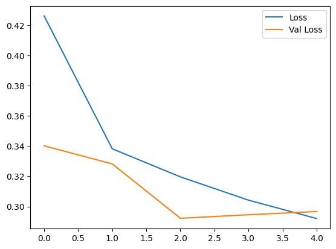

# CSE151AGroupProject

Group Project for 151A

Last updated 2/25/2024 at 3:53 PM

## Group Members:

Rehan Ali <rmali@ucsd.edu>

Aritra Ghosh <a7ghosh@ucsd.edu>

Scott Webster <s1webste@ucsd.edu>

Peter Chang <p7chang@ucsd.edu>

Yuhang Jiang <yuj052@ucsd.edu>

Milo Nguyen <mtn022@ucsd.edu>

Trevor Tran <trt004@ucsd.edu>

Michael Lue <mlue@ucsd.edu>

Jeffrey Do <jtdo@ucsd.edu>

Joseph Kan <jokan@ucsd.edu>

## INTRODUCTION

We ended up picking the "U.S. Government Revenue Collections" dataset from
Kaggle. Our model's target remains the same: predicting future revenue
collections based on the model's features.

## PREPROCESSING

Our data was relatively clean, so there wasn't too much to do here.
We checked for null values (of which there were none), dropped duplicates,
and got rid of columns that were redundant. The electronic category
description, channel type description, and tax category description were
already label encoded in separate columns, so those could be dropped.
Record date was also split into day, month, and year in other columns, so we
dropped that too. We discretized our record dates as datetime objects by # of days.
(For example, the oldest entry is at day 0, and the latest entry is at day 7026)
We made sure that each duplicate column matched one another before deleting them.

We first wanted to see how fiscal quarters were related to each other by year.
Finding a "not large" standard deviation between quarters, we decided that this
fiscal data was evenly distributed, so we could use it without further preprocessing.

## DATA EXPLORATION

We became "one with the data." Shapes, data types, unique values per feature, unique days,
entries per year, net collections amount by year, net collections amount by electronic
category, channel type, and tax category, etc. etc. etc.

We then shoved all of these into a heatmap to look for correlations between features, finding
that net collections amount is correlated pretty strongly with the different category IDs,
which tells us that certain categories of transaction give more revenue that others. A couple
bar charts reveal that a majority of revenue is associated with certain categorical descriptions.
This makes sense intuitively: certain avenues are more profitable than others.
Correlating these descriptions could help us make predictions!

We then made a scatterplot of all net collections amount by date. This only tells us that a majority
of collections made were small, with a sparse number of outlying large collections. There is a noticeable
trend that these outliers increase in count and magnitude as years go on.

Is this commensurate with growing income inequality? Or maybe the government got better at collecting?

Investigating further, we made a line-plot of average net collections amount by fiscal year. This showed a linear increase
atmosphere, which we shall do sparsely: the impact of COVID-19 caused a temporary recession followed by massive growth in the upper
quartiles of wealth and industry. (Amazon and Zoom, for example, thrived in this period.) This was not without a cost: income
inequality grew dramatically, so while the economy grew, people got _poorer_- meaning the large number of concentrated small collections
decreased in magnitude.

Or, it could just be some outlier bending our curve. It might be tempting to interpret these graphs based on income, but these collections
cover a lot more than just income tax. Our future work in prediction modeling may reveal more about the root cause of this trend.
(We could also do extra work that involves more datasets, but that's beyond the scope of this project.)

## 1st Model Conclusion (Milestone 3):

For our first model we attempted to use linear regression in predicting net collections amount. As evidenced by the [high MSE and MAE values](https://colab.research.google.com/github/rayfin-ucsd/CSE151AGroupProject/blob/main/milestone_3.ipynb#scrollTo=xuHT7N0lsQrp), while the model is a good starting point, it needs refinement to improve its predictive accuracy. Since both the training and testing errors were high, our first model is most likely underfitting.

To enhance this model, we should first explore feature engineering to develop more informative variables that could better explain the variability in the net collections amount. Furthermore, considering the possibility of non-linearity of the relationships in the data, more sophisticated models such as polynomial regression or a random forest might be better suited for prediction. These models can capture complex patterns that a simple Linear Regression might miss. Finally, we could also utilize some form of hyperparameter tuning. Using techniques like grid search or random search, ideally with cross-validation, will help in identifying the most effective model parameters - thereby increasing performance. An ANN model would also be a potential solution, where hyperparameter tuning can again be applied to test out different activations and layer parameters.

Moreover, it could be beneficial to [encode net collection amounts](https://colab.research.google.com/github/rayfin-ucsd/CSE151AGroupProject/blob/main/milestone_3.ipynb#scrollTo=72b9b09d) into classes (ex. $1000-$10000, $10001-$50000, $50000+, etc.), turning this into a classification problem. This could prove to be more accurate since instead of predicting continuous values, the model would simply have to predict which range the collection amount would fall under. We could then use neural networks and perceptrons as our model to predict which range of values each observation falls under. With this, we could also tune this model using the hyperparameter tuning techniques mentioned above. Indeed, encoding net collection amounts into classes for classification could offer a more accurate prediction framework.

Overall, our findings provide valuable insights for policymakers and researchers interested in forecasting government revenue collections, and our proposed model enhancements offer promising avenues for future research and refinement.

## 1st Model Evaluation (Milestone 4):

Our initial model used linear regression and tried to predict the net collections amount. However, the high MSE and MAE values show that, despite its simplicity, the model falls short of our predictive accuracy goals. There are significant errors in both training and testing which suggest a large amount of underfitting. The main issue stems from a regression model for a dataset that seems to be much better suited for classification. By segmenting the net collections amount into discrete ranges, we transform the challenge from predicting precise values to identifying the appropriate range. Indeed, shifting from a regression to a classification approach for predicting net collections amount is justified by the advantages offered by classification in terms of simplicity, accuracy, flexibility, interpetability, and the capability to navigate non-linear relationships more effectively. To implement this, we propose changing net collection amounts into predefined classes (e.g., $1000-$10000, $10001-$50000, $50000+) and then trying to classify those categories. Our other labels seems to be fine, but we could go back into feature engineering/EDA to look deeper at net collections amount. A neural networks or other classification model, could significantly improve our prediction accuracy. This model would not only align with the quantifiable nature of our data but also allow us to use more complex model types.

## 2nd Model Evaluation (Milestone 4):

The second model's training accuracy compared to its testing accuracy is not too far off, with a [training accuracy of 89% and a testing accuracy of around 88%](https://colab.research.google.com/github/rayfin-ucsd/CSE151AGroupProject/blob/main/milestone_3.ipynb#scrollTo=c2c9e760). From this, it seems like the model does not overfit or underfit too much, as the error for the testing and training sets does not deviate too much. Our validation loss also did not end up too close to our training loss, which supports this as well. Compared to our first model, this model seems to be a much better fit since the first model severely underfit. To construct the model, we used early stopping and performed hyper parameter tuning across multiple activation functions such as tanh, sigmoid, and relu and tested the number of units and layers in the model. We found that [relu and 3 hidden layers with 64, 32, and 24 units performed](https://colab.research.google.com/github/rayfin-ucsd/CSE151AGroupProject/blob/main/milestone_3.ipynb#scrollTo=91f73695) the best. Using loss functions other than categorical crossentropy did not give good results. When tuning this model, we found that the model would frequently get stuck outputting a single class since the Net Collections Amount in our dataset skewed so heavily towards a particular range of values. To alleviate this, we used [undersampling](https://colab.research.google.com/github/rayfin-ucsd/CSE151AGroupProject/blob/main/milestone_3.ipynb#scrollTo=b5617a96) to reduce bias in our training by only using a fraction of the majority class observations for training. For our next model, we plan to construct a more complex regression model since we feel that we can greatly improve on our first simple regression model with the techniques we've now learned. Indeed, the experience and insights gained suggest a return to a more sophisticated regression model might yield improved results. Leveraging advanced techniques and the knowledge acquired from both the initial and second models could bridge the gap in predictive performance. All in all, the second model's success, compared to the initial attempt, underscores the importance of matching the model type to the nature of the prediction task. The move from regression to classification addressed the fundamental issue of underfitting.

Our training vs. validation loss curve for the classification model

## 2nd Model Conclusion (Milestone 4):

Our second model was a classification model that used neural nets to predict the rank of the net collections amount for each observation. To convert each continuous Net Collection Amount into a discrete class, we split the values into uniform ranges and assigned each observation a corresponding class based off of this. We encountered various issues in the process of converting this into a classification problem, such as reducing the bias towards certain classes in the data, but we were ultimately able to overcome these hurtles utilizing the techniques we've learned in class. Some further improvements could be to undersample even further since the model still skews slightly towards the majority class. We could also experiment more with how we discretize the Net Collections Amount to try and further reduce this bias. The second model performed fairly well in terms of accuracy, especially compared to our first linear regression model. This is likely due to its increased complexity through introducing neural nets to the second model as well as it having more parameters to tune, such as activation functions and number of hidden layers.

